# CORTEX-12
[](LICENSE)
[]
[]

<p align="center">
  
</p>

## A Compact Visual Cortex for Grounded, Neuro-Symbolic Reasoning

**CORTEX-12** is a CPU-only visual cortex that learns stable, interpretable
vector representations for grounded perception using JEPA principles,
contrastive alignment, and explicit memory. It prioritizes **clarity,
stability, and reproducibility** over scale or benchmark performance.

---

## Table of Contents

- [Overview](#overview)
- [Core Capabilities](#core-capabilities)
- [Why CORTEX-12](#why-cortex-12)
- [Quick Start](#quick-start)
- [Phase-2 Training](#phase-2-training)
- [Use Cases](#use-cases)
- [Evaluation Philosophy](#evaluation-philosophy)
- [Contributing](#contributing)
- [License](#license)
- [Citation](#citation)

---

## Overview

CORTEX-12 is designed as a **representation substrate** rather than an
end-to-end agent:

- Learns **128-dim visual embeddings** from pixels  
- Supports **interpretable semantic axes** (color, shape, size)  
- Uses **explicit external memory** rather than implicit weights  
- Safe for long unattended CPU training

Unlike large models, CORTEX-12 is **simple, inspectable, and deterministic**.

---

## Core Capabilities

- RGB images → compact vector embeddings  
- Explicit semantic attributes (color/shape/size)  
- Stable similarity comparisons across checkpoints  
- Compositional imagination via structured rendering  
- CPU-only execution (AMD-friendly)

---

## Why CORTEX-12

**Not a large language model, generative model, or foundation model.**  
Rather, CORTEX-12 focuses on:
- **Grounded perception** with explicit memory
- **Interpretable geometry** instead of opaque weight embeddings
- **Representation stability** over competitive accuracy

This makes it suitable as **a visual cortex module** rather than a
standalone task solver.

---

## Quick Start

### Setup (Windows PowerShell)

```powershell
python -m venv venv
.\venv\Scripts\Activate.ps1
pip install --upgrade pip
pip install -r requirements.txt
```

## What CORTEX-12 Is (and Is Not)

**CORTEX-12 is:**
- A visual representation system
- A compact “cortex” rather than an end-to-end agent
- Explicitly grounded in perception
- Designed for long, unattended CPU training
- Suitable for neuro-symbolic research

**CORTEX-12 is not:**
- A large language model (LLM)
- A foundation model
- A generative image model
- An end-to-end task optimizer

---

## Core Capabilities

- RGB → compact 128-D latent vectors
- Explicit semantic axes (color, shape, size)
- Stable similarity-based reasoning
- External, inspectable concept memory
- Compositional imagination via rendering
- CPU-only operation (AMD-friendly)

---

## Repository Structure

### Core Runtime
- `vl_jepa_llm_v12.py` — CORTEX-12 runtime (visual cortex + memory)
- `brain_vector_v12.pth` — active cortex weights (adapter + heads)
- `memory_vector_v12.json` — explicit concept memory

### Training
- `train_cortex_phase2_tinyimagenet.py` — Phase-2 trainer (Tiny-ImageNet)
- `runs/` — training checkpoints

### Tests & Utilities
- `run_all_v12_tests.py`
- `test_v12_smoke.py`
- `test_v12_parse.py`
- `test_v12_size_compare.py`
- `test_v12_compare_stability.py`
- `bench_v12_forward.py`
- `amd_batch_stress_test.py`

---

## Requirements

- Windows 11
- Python 3.10+ (3.11 supported)
- CPU-only PyTorch
- AMD Ryzen-class CPU recommended

---

## Setup (Windows PowerShell)

```powershell
python -m venv venv
.\venv\Scripts\Activate.ps1
pip install --upgrade pip
pip install -r requirements.txt
```
## CPU-only PyTorch (if needed)
```
pip install torch torchvision torchaudio --index-url https://download.pytorch.org/whl/cpu
```

---
## Diagrams testing








The contrastive objective minimizes:

$$
\mathcal{L}_{i} = -\log
\frac{\exp(\text{sim}(z_i,z_j)/\tau)}
{\sum_{k\neq i}\exp(\text{sim}(z_i,z_k)/\tau)}
$$
